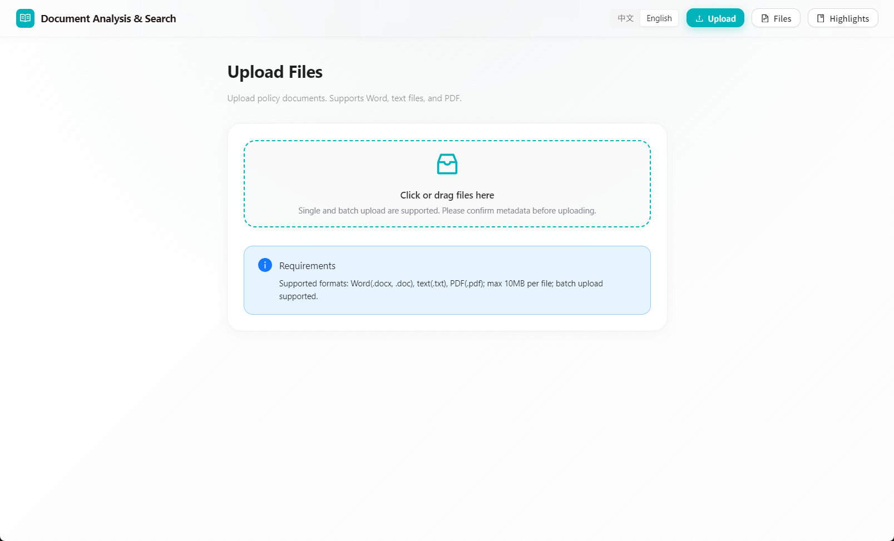

# RuleScope

RuleScope is a desktop app for browsing, searching, and outlining regulation documents. It is designed for structured policy files in Word, text, and PDF formats, with special support for Word auto-numbering recognition such as `Chapter 1`, `Article 1`, and `(1)` style headings.

[中文说明](./README.zh-CN.md)

## Highlights

- Desktop app built with Electron
- React + Ant Design frontend
- Embedded Express backend
- Upload and manage `.docx`, `.doc`, `.txt`, and `.pdf`
- Automatic outline extraction from Word numbering definitions
- In-document search and outline navigation
- Highlight collection with note support
- Chinese / English language switch
- Portable Windows build support

## Screenshots

## Download and Use the EXE

The recommended way for end users is to use the portable Windows package from GitHub Releases.

### Steps

1. Open the latest release on GitHub.
2. Download the portable package.
3. Extract the folder to any local directory.
4. Run `RuleScope.exe` or the packaged application executable inside the extracted folder.
5. Keep the executable and the `resources` folder together in the same directory.

### Notes for the portable version

- No installer is required.
- The app stores uploaded files and local metadata next to the portable executable during packaged usage.
- If you move the portable folder, move the entire folder together.
- Do not delete the `resources` folder or the locale files beside the executable.

## License

MIT
